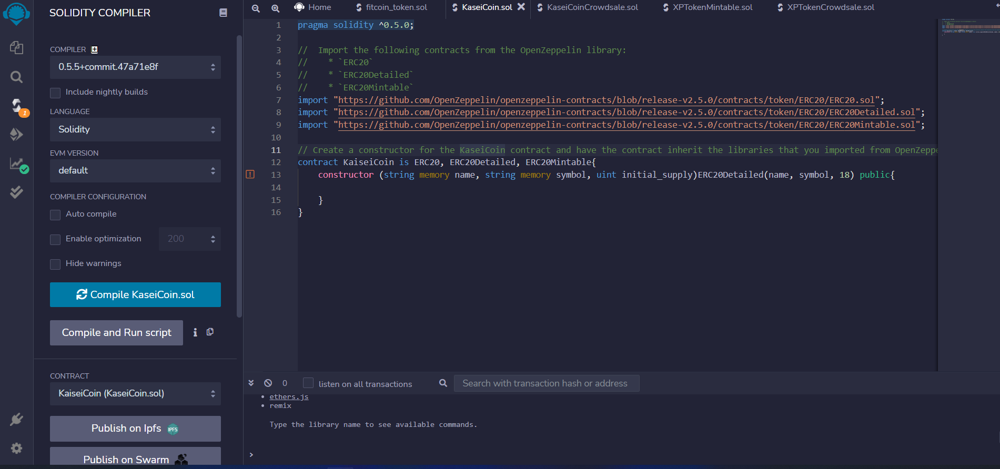
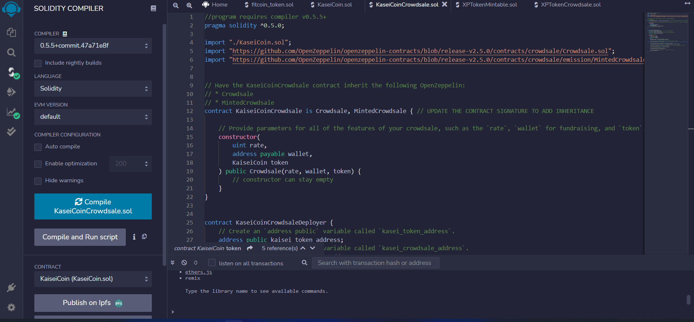
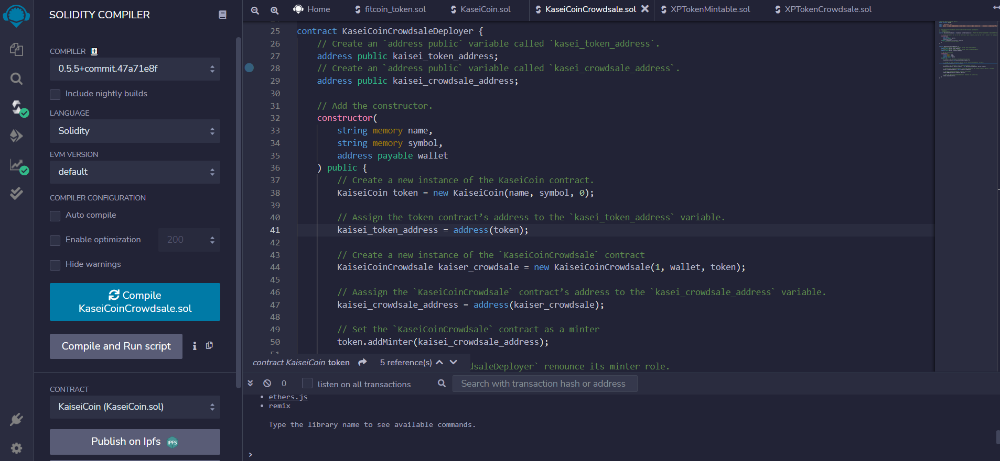

# Crypto_Crowdsale_Demo

This program simulates a testnet hosting a crowdsale for a new crypto token. The program runs using two solidity files and we are inheriting contracts from openZeppelin for both our coin and our crowdsale. KaiseiCoin.sol contains the contract for the coin we are selling and inherits ERC20, ERC20Detailed, and ERC20Mintable, which will give us a lot of built in functionality for our coin. KaiseiCoinCrowdsale.sol holds both the crowdsale contract and a deployer for both the crowdsale and the coin. We are inheriting Crowdsale and MintedCrowdsale in our crowdsale contract which gives us the functionality to mint new coins for wallets purchaing from the contract.

### Deployment

The two files are designed to run through a Ganache testnet connected via MetaMask. To deploy the contracts, compile both files in solidity using version 0.5.5 or greater. After compiling both files, switch to the injected web3 environment to use the accounts imported to MetaMask, and select the account on MetaMask which you want to use to deploy the crowdsale on. First deploy the KaseiCoinCrowdsaleDeployer, which will provide an address for an instance of the token and crowdsale for you to deploy them on.

After deployment each address you have connected in MetaMask can buy tokens from the crowdsale. The balance of each account and the total supply of the token are provided in helper functions in the Kaisei coin contract, and the total amount of Wei raised is provided in the crowdsale contract

